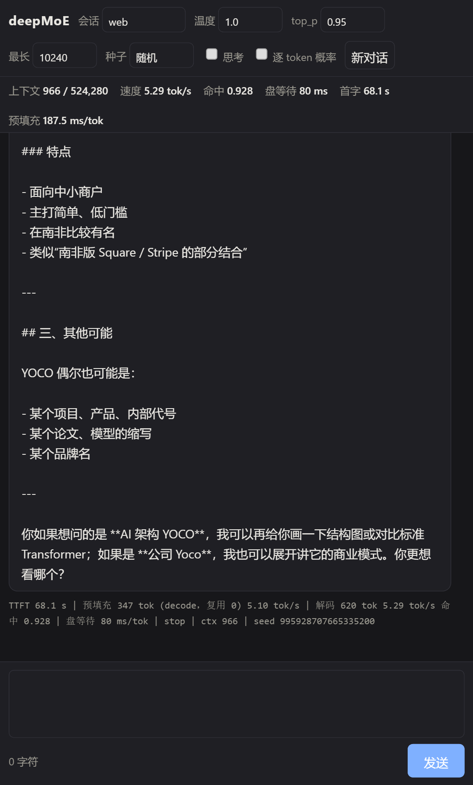

# deepMoE

Windows Strix Halo（Ryzen AI Max+ 395 / Radeon 8060S / 128 GB / NVMe）专用的超大 MoE 本地推理 Runtime。目标模型：**DeepSeek-V4.1-Flash**（552B backbone + 196B Engram，decode 激活 16B，510 GB 权重）。

- **单一入口：[docs/STATUS.md](docs/STATUS.md)** — 今天量到了什么、什么被试过并退掉（编号）、测试套件、下一步顺序。**相信任何数字之前先看这里。**
- 设计方案：[docs/design.md](docs/design.md)（v0.9）
- 模块依赖与线程模型：[docs/architecture.md](docs/architecture.md)
- 构建、环境、对话与 worktree 工作流：[docs/build.md](docs/build.md)

核心思路：权重原生 FP4/FP8 不再量化；**运行时直接读 ModelScope 下下来的 48 个 safetensors 分片，不 repack**（`deepmoe_manifest.json` 是一份纯地址簿，design §5.1）；常驻部分 pin 在统一内存，routed expert 在 NVMe 与内存之间由 Planner（精确全局 LRU）流式调度；Vulkan Compute（Slang），command buffer 只在 gate 处切开（每 token 41 次 submit）；prompt 在 GPU 上整块 prefill；**KV 按模型格式算账，sliding-window KV 从不持久化**（design §11.2）；DSpark 投机解码在本机**实测 NO-GO**（验证批的专家并集按 token 数长，盘瓶颈下 0.86×，STATUS §3 的 41/42）；所有优化以 oracle 与可分解的每 token 时间线为准。

```powershell
cmake -S . -B build -G Ninja -DCMAKE_TOOLCHAIN_FILE=cmake/zig-toolchain.cmake -DCMAKE_BUILD_TYPE=Release
cmake --build build
.\build\deepmoe.exe info
ctest --test-dir build --output-on-failure
```

## 当前状态：**能聊、有网页、长 prompt 秒级起步**（2026-09-19）

```powershell
.venv\Scripts\python.exe tools\web\server.py        # 网页对话 http://127.0.0.1:8080（多标签页 = 多会话，长文粘贴，取消）
.venv\Scripts\python.exe tools\chat.py              # 终端对话；/reset /think /drop /temp /top_p /greedy /max /seed /system /stats
```

<p align="center"></p>

一个 `deepmoe serve` 进程常驻 pinned 集合（9.17 GiB）+ expert cache（`auto` 探出 **5,000 槽 / 87.6 GiB**）+ KV；
对话由 checkpoint 自己的 `encoding/encoding.py` 渲染，C++ tokenizer 转 id，流式出 token；新一轮复用前缀，`.pkv` 落盘跨进程复用。

| | 今天（5,000 槽，安静机） |
|---|---|
| 对话 decode | **5.0–5.1 tok/s**（hit 0.90–0.94）；每 token ≈ 97 ms 计算 + ≈ 100 ms NVMe stall |
| 两路对话并发 | 聚合 **5.5 tok/s（+17.5%）**，单路不退化 |
| 热步（expert 全驻留） | **97.0 ms**（`auto`）/ 92.7 ms（全 path A） |
| 长 prompt TTFT（GPU prefill，默认开） | 1,118 token **28.6 s（热）/ 39 s（冷）**，≈ 25 ms/token；4,133 token **100 s** |
| 第二轮续写（+400 token） | **35.5 s**（复用 vs 整段重 prefill 自动二选一） |
| 上下文上限 | **524,280 token**（indexer 一次 dispatch 的硬限；KV 到那时 1.56 GiB） |
| 正确性（对 fp32 参考） | 64 token 8/8；**4K / 17K 教师强制 8/8、自由运行 8/8**；64 步 PPL 尺子 `bench.l3_ppl64`（off = 参考 ×1.033） |
| tokenizer / 采样 | 对 HF `tokenizers` 24,897 用例 **100% 一致**；GPU top 集合 + 主机精确核，0 次回退 |
| 测试 | `ctest` 46 项（CPU 25 + GPU），`tests/run_all.py` 29/29，`tests/mutate.py` 17 条变异全抓住 |

**为什么是 5 tok/s，以及还能往哪走**——每 token ≈ 97 ms 算力（8.5 GB 稠密权重 @ 216 GB/s 是底）+ 21 个 miss × 18.8 MB ÷ 盘带宽。
软件侧的杠杆已经**全部实测并记入 STATUS §3（61 条试过/退掉）**：量化 2/3-bit ✗、预取/整层钉住/分层流式 ✗、投机解码 ✗、常驻路由四档 ✗、score-aware 淘汰 ✗（+2.3%）、持久 dispatch ✗、gate 往返 ✗（265 µs 是驱动的）、staged fill ✗；
拿到的：M=1 MoE 特化 −4.7%、IO 提交并行 +3.5%、prefill 分配预留 10.6×、GPU prefill 默认开 5.9×、两路并发 +17.5%。
**剩下的杠杆在硬件**：第二个读源（`--mirror DIR`，读路径 + 健康闸已就位，等一个不掉线的 USB4/NVMe 盒；预测 +35–40%），或第二台 128 GB 机器按层流水线。

**走到这里的里程碑**：P-1 / P1 测量（内存系统是一个 ~217 GB/s 的共享上限、全局 LRU、不做 lookahead）→ P2 常驻路径 kernel 逐级对齐参考 →
**第一个 token**（v0.8：134 ms 热步）→ **nothing loaded + 81.5 ms**（Track I）→ **GPU prefill、4K / 17K 长上下文、对话**（Track J / K2 / L / M / P / Q，v0.9）。

**原始报告**（结论都写回了 design.md，冲突时以后写的为准，v0.9 发现的冲突在 design 附录 C）：
P1 [kernel_p1.md](docs/kernel_p1.md)、[route_trace.md](docs/route_trace.md)；
P2 [kernel_p2_moe.md](docs/kernel_p2_moe.md)、[p2_attention.md](docs/p2_attention.md)（§13 是 Track J）、[p2_decode.md](docs/p2_decode.md)（§9–§13 是 Track I）；
P3 [p3_dspark.md](docs/p3_dspark.md)（K / K2）、[p3_prefill.md](docs/p3_prefill.md)（L）、[p3_longctx.md](docs/p3_longctx.md)（M）、
[p3_longctx_decode.md](docs/p3_longctx_decode.md)（Q）、[p3_chat.md](docs/p3_chat.md)（P）。

| 已实现 / 已实测 | 桩 / 没做 |
|---|---|
| `core/`：`Result<T>`、4 KiB 对齐、JSON 读写、Profiler（每 token JSONL） | — |
| `model/`：`config.json` 与 `deepmoe_manifest.json` v2（run/skew 地址簿）+ 与 `layout.h` 的交叉校验 | — |
| `text/`：**C++ tokenizer**（对 HF 100%，`deepmoe tokenize`） | engram hash 常量在 C++ 里推导（今天读 `tests/data/l3`） |
| `storage/`：优先级队列 + 切分 + QD；IOCP 后端（`FILE_FLAG_NO_BUFFERING\|OVERLAPPED`）；NVMe 直读进 GPU slab 零拷贝；忙碌记账按在途窗口并集 | DirectStorage |
| `store/`：slab 池（路径 A + B，`auto` 先算后探、硬上限 5,000 槽）、每 expert 6 项的 GPU 指针表、**Planner = 与 `cache_sim` 逐步相同的全局 LRU**、pinned 集合（9.17 GiB / 3.4 s） | 层间重叠（预取实测负收益，不做） |
| `cpu/`：FP4 / FP8 / E8M0 解码、`act_quant_block`、router 数学、**`dspark_tree`**（树采样的格 / 路径 / confidence / 温度 1 精确接受，对 Python 参考逐位） | AVX-512 GEMV |
| `gpu/vulkan`：两条内存路径、timeline（驻留 + 完成两条）、`moe_kernels`、`attn_kernels`、`decode_kernels`（engram / head / **sample_topk**）、**`dspark_kernels`**、**`prefill_kernels`（`gpu::Prefill`）** | M > 1 的 attention 族 / head / engram（T）；Track J 的 K-split / tiled 接口还没被 runtime 采纳 |
| `gpu/shaders`：decode 全链（mega_mhc / wq_a / wq_b / wkv / sparse_attn / wo_a / wo_b / gate / head / compressor / indexer 含 candidate block / engram / MoE 三件 / sample_topk）、Track J 的 `gemv_ksplit` / `sparse_attn_t`、DSpark 草稿四个、prefill 五个；全部过 `slangc` + `spirv-val` | GPU 上的 indexer top-k（prefill）；`gate.slang` 的 softplus 数值 |
| `runtime/`：`engine`（token 循环、`shared_attn` 路由、在 gate 处切开的 buffer、`slow_prefill`、`gpu_prefill` / `seed_from_prefill`、会话）、`kvstore`、`decode_layer`（列表长度加固）、`moe_bridge`（一个 7 槽 runner）、`engram`（token 开始时预取）、`decode_state`、**`session`**（回退 / `.pkv` 持久化 / 命名会话）、**`sampling`**、`stream`（多路）、`resident_route`、`speculate` + `forward_batch`（M≤6，仅实验） | 非零位置的 GPU 续接 prefill（STATUS §3 的 61） |
| `cli`：`info`、`bench nvme`、`run`（`--slow-prefill --loaded-ced --warm --determinism --gate-report --topk-report --per-layer --profile`）、`tokenize`、**`serve`** | — |
| `tools/`：`manifest.py`；oracle L0–L3 + `oracle_l2_extra` / `oracle_prefill` / `oracle_longctx` / `oracle_dspark` / `dspark_tree`；`route_trace` + `cache_sim`；**`chat.py`**、**`web/`**（网页对话）、`l3_ppl.py`、`trace_timeline.py`、`hitrate_*` / `cache_*_study` 模拟器 | 64 token 的第 2–5 个 L3 prompt |
| `bench/`：`nvme_bench`、`bw_matrix`、`kernel_bench`、`attn_bench`、`heap_capacity`、**`prefill_bench`**、`io_dst_bench`、`probes/`（residency / sharing / capacity）、`d2_abab.py` | 安静机上同口径的 TTFT |

需要真 checkpoint 的测试默认自动跳过；给出 `DEEPMOE_MODEL_DIR` 后跑（命令与每个 suite 验什么见 build.md）：

- `suite.integration` / `suite.gpu_moe` / `suite.gpu_attn` / `suite.gpu_layer`：读路径、MoE kernel、attention 逐 stage 与整层对 L1 / L2 oracle。
- **`suite.decode`**：四十层、八步对 L3（从导出状态 8/8 / 8/8，从慢 prefill 7/8 / 6/8，差的是一个参考 margin 0.95 的近似平局）。
- **`suite.decode_longctx`**：4K / 17K 的 indexer kernel 在参考输入上 tie-aware、引擎逐层逐步、8 步教师强制 + 8 步自由运行（需要 `traces/longctx/`，见 `DEEPMOE_LONGCTX_DIR`）。
- **`suite.gpu_prefill`**：prefill 逐 stage（110 项）、64 token 进引擎；`DEEPMOE_PF_LONGCTX` 给出长上下文导出时跑 4K / 17K 交接与之后的 decode。
- **`suite.gpu_dspark`**：DSpark 草稿 kernel 逐阶段对参考。
- 纯 CPU：**`suite.tokenizer`**（909 个黄金用例）、**`suite.sampling`**（L3 logits 上 200,000 次抽样的 χ²）、**`suite.dspark_tree`**（对 Python 参考逐位）。

```powershell
$env:DEEPMOE_MODEL_DIR='D:\models\DeepSeek-V4.1-Flash'; ctest --test-dir build --output-on-failure
```
