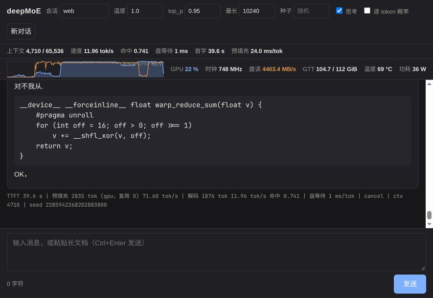

# deepMoE

**Run DeepSeek-V4.1-Flash on a single 128 GB AMD Strix Halo PC.**

deepMoE is a C++20 inference engine with Vulkan and Slang kernels. It runs the
**552B MoE model, plus 196B Engram parameters**, from its **510 GB native FP4/FP8
checkpoint**. Dense weights stay resident; a bounded expert cache streams the
remaining weights from NVMe. No re-quantisation, shard conversion, or repacking.

[Quick start](#quick-start) · [Performance](#measured-performance) ·
[Web chat](tools/web/README.md) · [Technical status](docs/STATUS.md) · [MIT license](LICENSE)

<p align="center"><br>
<sub>Live short demo: dynamic mask, DSpark k=5 / top-K=4, two drives. The 10.04 tok/s display is this demo, not the eight-turn benchmark.</sub></p>

## What it does

- **Native model arithmetic:** FP4 routed experts, FP8 dense weights, compressed
  sparse attention, hyper-connections, and Engram tables.
- **NVMe-backed inference:** priority reads into GPU-visible slabs, asynchronous
  expert loading, a global LRU cache, and an optional second checkpoint mirror.
- **GPU prefill and persistent sessions:** batched prompt processing, common
  prefix reuse, named conversations, and optional KV parking on disk.
- **Local web chat:** live throughput and hardware telemetry, Markdown answers,
  a separate collapsible thought process, and reasoning effort controls.
- **Experimental decode modes:** dynamic-cache miss masking and DSpark with one
  draft path verified in a single batched forward pass.

`main` is the Linux/RADV line. The older Windows implementation is maintained
separately on the [`windows` branch](https://github.com/acupof-ai/cachedMoE/tree/windows).
The tested target is AMD Strix Halo (`gfx1151`); portability to other GPUs is not established.

## Quick start

You need a 128 GB Strix Halo system, sufficient GPU-visible memory, and at least
510 GB for the checkpoint. A second NVMe with an identical checkpoint is optional.
Keep additional disk space for the build and optional KV cache.

Build on Linux with clang 22 or newer, CMake, Ninja, `shader-slang`, `spirv-tools`,
Vulkan headers, and a RADV driver with the required cooperative-matrix support.
See [build details](docs/build.md) for the environment and driver configuration.

```bash
git clone https://github.com/acupof-ai/cachedMoE.git
cd cachedMoE
cmake -S . -B build -G Ninja \
  -DCMAKE_TOOLCHAIN_FILE=cmake/linux-clang-toolchain.cmake \
  -DCMAKE_BUILD_TYPE=Release
cmake --build build
```

Download the checkpoint and create its address manifest. ModelScope downloads
must use a direct connection. The manifest is the only file written inside the
checkpoint directory; the original shards are read directly.

```bash
env -u HTTP_PROXY -u HTTPS_PROXY -u ALL_PROXY \
    -u http_proxy -u https_proxy -u all_proxy \
  modelscope download --model deepseek-ai/DeepSeek-V4.1-Flash \
    --local_dir "$HOME/models/DeepSeek-V4.1-Flash"
python3 tools/manifest.py --src "$HOME/models/DeepSeek-V4.1-Flash"
export DEEPMOE_MODEL_DIR="$HOME/models/DeepSeek-V4.1-Flash"
```

Start **one** of these clients:

```bash
python3 tools/web/server.py          # http://127.0.0.1:8080
python3 tools/chat.py                # terminal chat
./build/deepmoe serve --model "$DEEPMOE_MODEL_DIR"   # JSON-lines protocol
```

The web UI defaults to English. Model replies follow your prompt's language.
The initial engine load takes time; wait for its ready message. Use automatic
cache sizing first. Explicit cache budgets depend on the machine's memory layout.

## Measured performance

These measurements use Linux/RADV on a 128 GB Strix Halo PC. They describe
particular workloads, not a guaranteed rate for every prompt. The two-drive
results use an identical read-only mirror, with all 48 shards available.

| Mode and workload | Decode throughput | Conditions and evidence |
|---|---:|---|
| Exact routing, eight conversation turns | **9.20 tok/s** | Two drives, clean start without saved KV; [status ledger, run 29](docs/STATUS.md) |
| Exact routing, same eight turns | **7.61 tok/s** | One drive, clean start; [status ledger, run 28](docs/STATUS.md) |
| Dynamic mask + DSpark, eight long turns | **9.52 tok/s** | Two drives, 5,500 cache slots, five draft tokens, target top-4 acceptance; 2,353 timed decode tokens; [long-run report](docs/mask_freeze.md) |
| Dynamic mask + DSpark, short instrumented run | **13.40 tok/s** | Two drives, same cache and speculation settings, 31 timed decode tokens; [trace report](docs/mask_async.md) |

The short and long speculative runs are different workloads. They do not establish
a speedup over exact routing at equal quality. Prompt processing is separate from
decode: an earlier exact GPU-prefill benchmark measured about **29 s at 4K** and
**45 s at 17K** tokens under its recorded cache and disk conditions. Follow-up
prefix reuse can reduce the work. See [STATUS](docs/STATUS.md) for attribution.

### Quality and experimental modes

Exact routing remains the engine default. On the Linux reference trace, the
current exact-path 64-step NLL is **0.622784**. The strict decode comparison is
currently **6/8**, or **7/8 with the engine's own prefill**; this is not a claim of
bitwise equality with the entire reference implementation.

`--resident-only mask --mask-cache dynamic` skips unavailable routed experts while
normal asynchronous loading and LRU updates continue. This changes the model's
output. The latest dynamic mask + DSpark run scored **48/57** on a small MMLU
screen (invalid answers counted wrong), but cold-cache mask NLL was **1.360084**.
That screen is not a full MMLU benchmark or a general quality guarantee.

`--dspark --spec-k 5 --spec-top-k 4` verifies the root and **one five-token draft
path** together. Top-K acceptance is approximate; it does not preserve the target
sampling distribution. It is off unless requested. Fixed-cache mask has produced
repetitive output; its roughly 18 tok/s result is excluded from the table above.

The context capacity is **1,048,576 tokens**. A full 1M-token prompt has not passed
an end-to-end quality test, and GPU prefill also needs enough working memory.
[Adaptive-cache findings](docs/mask_freeze.md) and [DSpark results](docs/dspark_topk.md)
include the quality gates, cycle costs, and unsuccessful experiments.

## Web chat

```bash
python3 tools/web/server.py --max-context 1048576
```

Open <http://127.0.0.1:8080/>. Enable **Thinking** to choose low (50), high (75),
maximum (100), or a custom effort from 1 to 100. Thinking streams into its own
panel; the answer appears below it. Completed panels collapse and remain available
in restored conversation history. **Ctrl+Enter** sends; **Stop** cancels.

The page has no CDN dependency. Conversations are stored locally, and requests
share one queued engine. A second read source is detected when its matching
manifest is present, or can be supplied with `--mirror`.

For experimental dynamic mask and speculation:

```bash
python3 tools/web/server.py --resident-only mask --mask-cache dynamic \
  --dspark --spec-k 5 --spec-top-k 4
```

Read the quality limits above before using this mode. Full configuration:
[web documentation](tools/web/README.md).

## Development and validation

```bash
ctest --test-dir build -j 1 -LE "needs-model|needs-gpu"   # CPU tests
python3 tests/run_all.py                               # Python tool gates
python3 tools/web/test_server.py                       # web settings/history
node --test tools/web/test_ui.cjs                      # streaming channel parser
```

GPU tests require the checkpoint and trace fixtures. **Run one GPU job at a time**;
the web engine also counts as a GPU job. Stop it before starting GPU benchmarks.
For numerical changes, run the oracle and long-context gates described in
[AGENTS.md](AGENTS.md) and [STATUS](docs/STATUS.md).

| Directory | Contents |
|---|---|
| `runtime/` | Token loop, sessions, KV storage, routing, speculation |
| `store/`, `storage/` | Expert cache, global LRU, priority I/O, mirror reads |
| `gpu/vulkan/`, `gpu/shaders/` | Vulkan runners and Slang kernels |
| `cpu/`, `text/`, `model/` | Reference maths, tokenizer, model config, manifest |
| `cli/`, `tools/` | Engine protocol, chat clients, oracles, trace tools, simulators |
| `bench/`, `tests/` | Benchmarks and validation suites |

Start technical work with [STATUS](docs/STATUS.md): it records measurements,
reverted experiments, and the next levers. Also see [design](docs/design.md),
[architecture](docs/architecture.md), and [build notes](docs/build.md).
Most detailed experiment reports are in Chinese. Contributions should include
the workload, hardware, quality checks, and evidence behind performance claims.

## License

The engine is [MIT licensed](LICENSE). The DeepSeek checkpoint and its bundled
reference code retain their own licenses.
